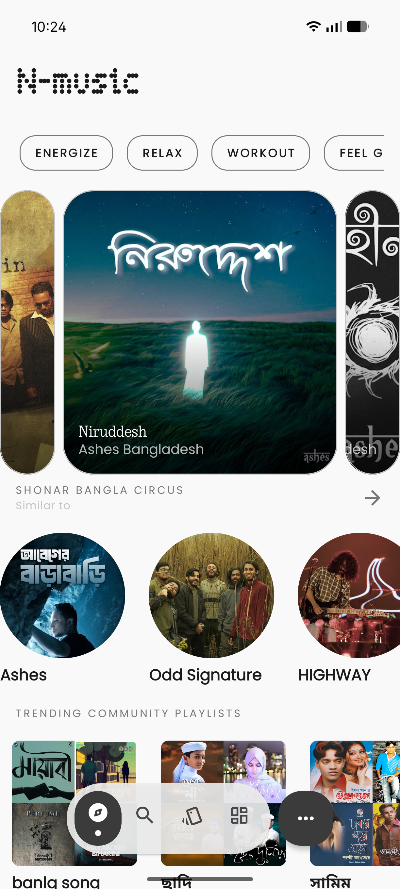
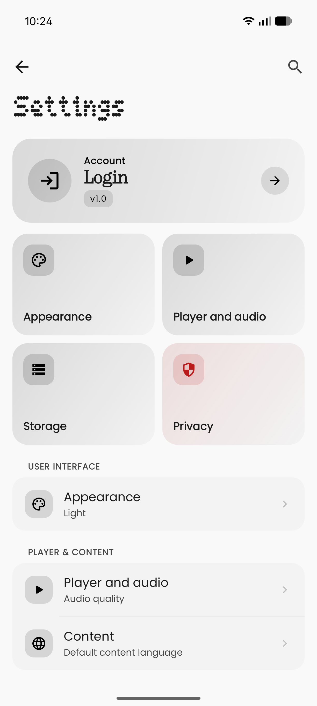
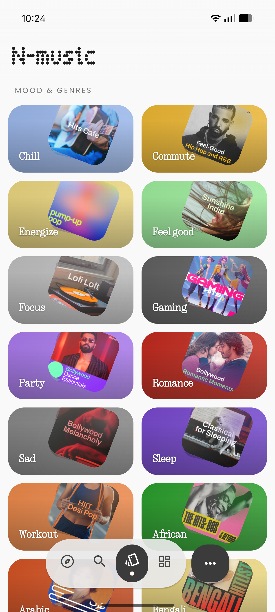
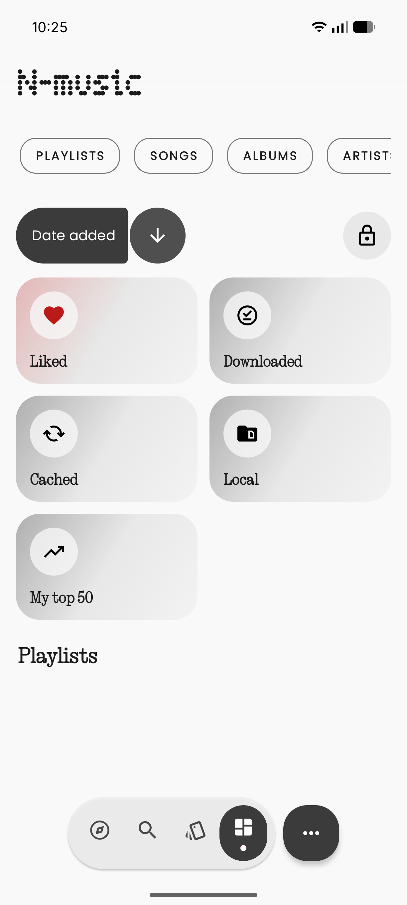
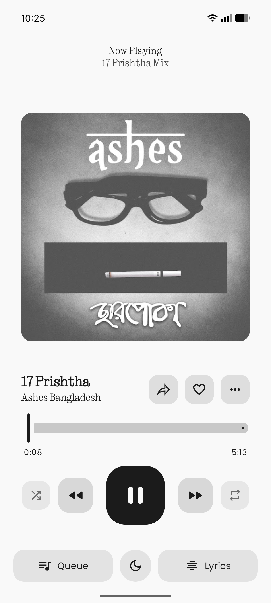

# N-Music

A Nothing OS inspired music player for Android.

N-Music focuses on a clean UI, smooth playback, and a lightweight experience.

## Quick Links

- Latest release: https://github.com/alimohsenmaruf/N-Music/releases/tag/Latest
- Source repository: https://github.com/alimohsenmaruf/N-Music
- Privacy policy: PRIVACY.md
- Contributing guide: CONTRIBUTING.md

## Screenshots

<table>
  <tr>
    <td></td>
    <td></td>
    <td></td>
  </tr>
  <tr>
    <td></td>
    <td></td>
    <td></td>
  </tr>
</table>

## Features

- YouTube Music integration
- Nothing OS inspired UI
- Playlist and library management
- Lyrics support
- Last.fm and ListenBrainz integrations
- Discord rich presence support
- Lightweight APK

## Download

Use GitHub Releases:

https://github.com/alimohsenmaruf/N-Music/releases/tag/Latest

## Build From Source

Requirements:

- JDK 21
- Android SDK

Commands:

```bash
git clone https://github.com/alimohsenmaruf/N-Music.git
cd N-Music
./gradlew assembleMobileUniversalDebug
```

Release build (with signing configured):

```bash
./gradlew assembleMobileUniversalRelease
```

## Project Modules

- app: Android application
- innertube: YouTube integration layer
- lastfm: Last.fm integration
- lrclib: lyrics support
- betterlyrics: lyrics provider support
- simpmusic, kizzy, kugou, shazamkit: integration modules

## Support

- Issues and feature requests: https://github.com/alimohsenmaruf/N-Music/issues

## License

Licensed under GPL-3.0.
See LICENSE for details.
